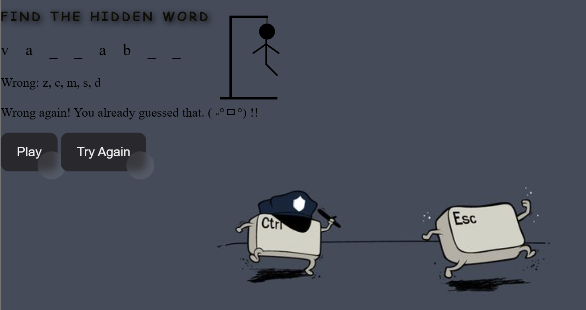

# 🕹️ Hangman Game

This is a simple **Hangman** game made with **HTML**, **CSS**, and **JavaScript**.  
The player guesses letters to figure out the hidden word.  
Each wrong guess draws part of the hangman.  
Guess the word before the full hangman is drawn to win!

---

## 🚀 Getting Started

👉 **Planning Materials:**
- User Stories
- Wireframe
- How to Play

---

## 🎮 How to Play

1. Open the link to the game.  
2. Type a letter to guess.  
3. Correct guesses reveal letters in the word.  
4. Wrong guesses draw the hangman.  
5. You win if you guess the word before the hangman is fully drawn!

---

## 💡 Technologies Used

- HTML
- CSS
- JavaScript

---

## 📚 Attributions

- Icons and sounds (if any) from free resources.

---

## 🚧 Next Steps

- Add themed word lists
- Add win/lose animations
- Make it mobile-friendly
- Add score tracking

---

